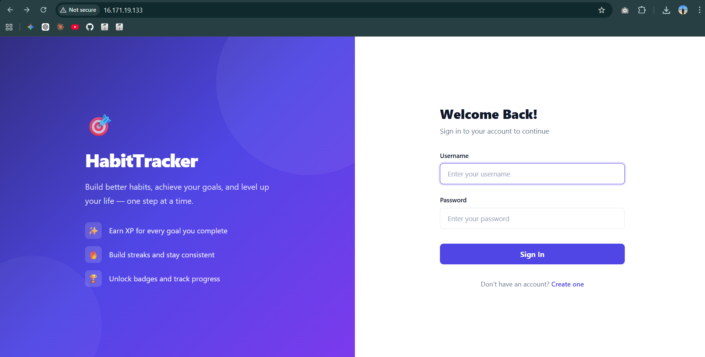
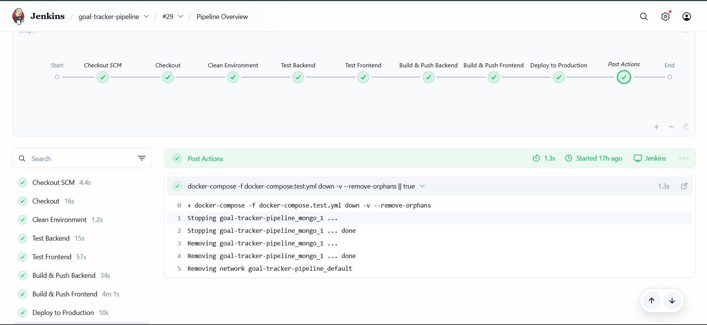
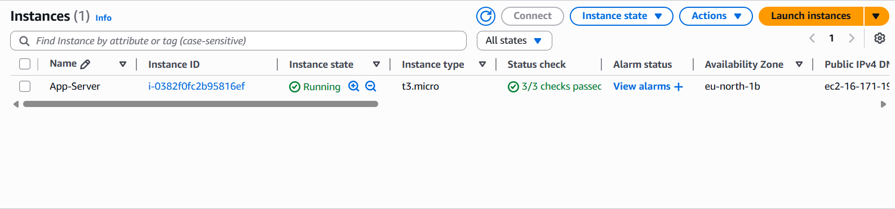

# 🚀 Gamified Goal Tracker | Cloud-Native DevOps Architecture

<div align="center">

[](https://github.com/hirushan666/gamified-goal-tracker)
[](https://hub.docker.com/u/hirushanww)
[](https://www.terraform.io/)
[](https://aws.amazon.com/)

**A production-ready Full Stack application deployed via a fully automated CI/CD pipeline.**
_Architected with Terraform, Configured with Ansible, and Orchestrated with Docker & Jenkins._

[View Demo](#) · [Report Bug](https://github.com/hirushan666/gamified-goal-tracker/issues) · [Request Feature](https://github.com/hirushan666/gamified-goal-tracker/issues)

</div>

---

## 🏗 System Architecture

This project demonstrates a **Cloud-Native DevOps Lifecycle**. The infrastructure follows the **Infrastructure as Code (IaC)** paradigm, and deployment is handled via a **Zero-Touch** pipeline.


### 🚀 Key Engineering Features

- **Infrastructure as Code:** AWS EC2 instances provisioned using **Terraform**.
- **Configuration Management:** Server environment setup automated via **Ansible**.
- **Containerization:** Full-stack services (Frontend, Backend, DB) isolated in **Docker** containers.
- **CI/CD Automation:** **Jenkins** pipeline triggers on Git push, runs tests, builds images, and deploys to production.
- **Traffic Management:** **Nginx** reverse proxy handles routing and CORS.

---

## 🛠 Built With

This project exploits a modern tech stack focused on scalability and automation.

- 
- 
- 
- 
- 
- 
- 
- 
- 
- 

---

## 📸 Application Demo

The application encourages habit consistency through gamification (XP, streaks, and rewards).



---

## ⚙️ The CI/CD Pipeline

The heart of this project is the automation pipeline. Every commit to the `main` branch triggers the following workflow:



1.  **Checkout:** Pulls the latest code from GitHub.
2.  **Clean Environment:** Removes orphaned containers/volumes.
3.  **Test:** Runs Unit & Integration tests (Jest).
4.  **Build & Push:** Builds Docker images and pushes to Docker Hub.
5.  **Deploy:** SSHs into the AWS Production Server and updates containers with zero manual intervention.

---

## ☁️ Deployment (AWS)

The production environment is hosted on an AWS EC2 instance, provisioned via Terraform.



### Manual Deployment Command (Reference)

The pipeline executes the following logic automatically:

```bash
docker run -d --name backend --network goal-tracker-net -p 3000:5000 \
  -e MONGO_URI='mongodb://mongo:27017/goaltracker' \
  -e JWT_SECRET='${SECRET}' \
  hirushanww/gamified-goal-tracker-backend:latest
```
